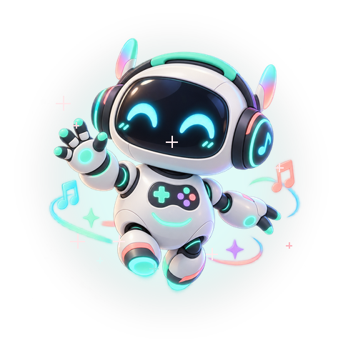
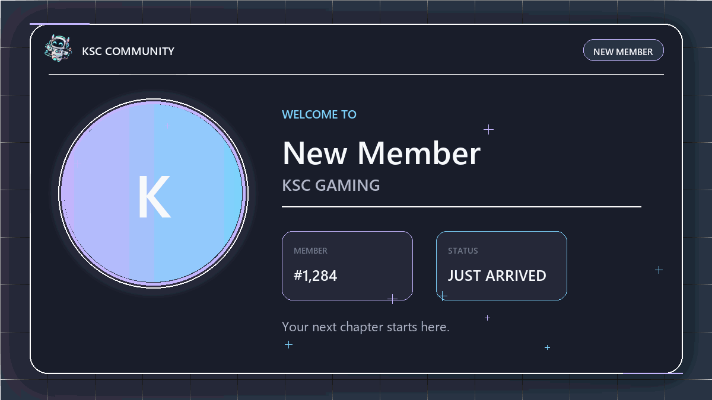
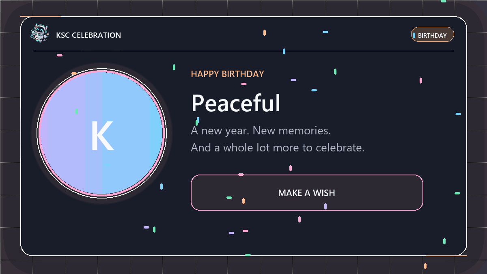
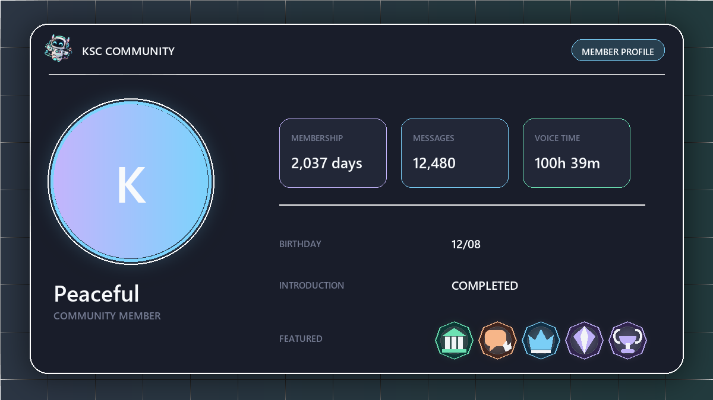

<div align="center">



# KSC Gaming

### Music that moves. Community that stays.

Discord bot phát nhạc YouTube và SoundCloud kết hợp hệ thống cộng đồng,
profile đồ họa, thành tựu tự động và analytics theo thời gian thực.

[](https://www.python.org/)
[](https://discordpy.readthedocs.io/)
[](https://www.youtube.com/)
[](https://soundcloud.com/)
[](#kiểm-thử)

[Tính năng](#tính-năng-nổi-bật) · [Cài đặt](#khởi-động-nhanh) · [Lệnh](#lệnh) · [Cấu hình](#cấu-hình) · [Kiến trúc](#kiến-trúc)

</div>

---

## Trải nghiệm

<table>
  <tr>
    <td width="50%" align="center">
      
      <br /><strong>Animated Welcome</strong><br />Shimmer, avatar pulse và hướng dẫn bắt đầu.
    </td>
    <td width="50%" align="center">
      
      <br /><strong>Birthday Celebration</strong><br />Confetti, lời chúc và giao diện sinh nhật riêng.
    </td>
  </tr>
</table>

<p align="center">
  
</p>

Profile Card 1200×675 tập trung vào avatar, số liệu cộng đồng và tối đa năm huy hiệu
được thể hiện bằng icon riêng. Card sử dụng dark glass, pastel accents và typography
đồng nhất với toàn bộ giao diện KSC Gaming.

## Tính năng nổi bật

| Hệ thống | Khả năng |
|---|---|
| **Music Engine** | Phát YouTube, SoundCloud, playlist, tìm kiếm tương tác và hàng đợi đa máy chủ. |
| **Live Player** | Components V2, artwork, waveform, progress, volume, loop và controls tiếng Anh. |
| **Audio Lab** | Equalizer realtime không ngắt nhạc; Bass Boost, 8D, Nightcore, Vaporwave và nhiều preset FFmpeg. |
| **Music Library** | Yêu thích, playlist cá nhân, lịch sử, lời bài hát, thống kê và Wrapped. |
| **Discovery** | AI DJ ưu tiên V-Pop Official MV, mood radio, autoplay thông minh và Listening Party. |
| **Community** | Welcome, introduction, birthday, Profile Card, achievement và celebration tự động. |
| **Analytics** | Heatmap, peak time, growth, funnel, retention, voice activity và Discord Event Analytics. |
| **Operations** | Control Center trong Discord, webhook cố định, SQLite bền vững và slash command sync nhanh. |

### Music không làm bẩn kênh chat

- Tin nhắn yêu cầu bài được xóa sau khi xử lý.
- Player công khai chỉ có một bản và luôn được cập nhật tại chỗ.
- Webhook Now Playing có thể tự đưa card xuống cuối kênh khi xuất hiện hội thoại mới.
- Playlist được giới hạn 50 bài để một yêu cầu không làm nghẽn hệ thống.
- YouTube được pipe trực tiếp từ `yt-dlp` sang FFmpeg, giảm lỗi URL CDN hết hạn và HTTP 403.

### Community chạy tự động

- Ghi nhận ngày gắn bó, tin nhắn và thời gian voice theo luồng nhẹ.
- Tự mở khóa achievement và tự chọn năm huy hiệu nổi bật nhất.
- Chỉ công bố cột mốc lớn tại `#celebrations` để tránh spam.
- Birthday Celebration, Weekly Recap và Analytics có cơ chế chống đăng trùng.
- Control Center cho phép admin bật/tắt tính năng, chọn kênh và quyền riêng tư ngay trong `#bot-config`.

## Khởi động nhanh

### Yêu cầu

- Python `3.11+`
- FFmpeg trong `PATH`, hoặc khai báo `FFMPEG_BINARY`
- Discord bot token
- `Message Content Intent` nếu sử dụng lệnh tiền tố `!`
- `Server Members Intent` cho Welcome, Member Log và hồ sơ thành viên

### Windows

```powershell
git clone https://github.com/peaceful-fptu-k16/KSCSupport.git
cd KSCSupport
./setup.bat
```

Mở `.env`, điền token và chạy:

```powershell
venv\Scripts\activate
python bot.py
```

### Linux / VPS

```bash
git clone https://github.com/peaceful-fptu-k16/KSCSupport.git
cd KSCSupport
chmod +x setup.sh
./setup.sh
source venv/bin/activate
python bot.py
```

Khi bot sẵn sàng, log sẽ có `Connected as ...` và số slash command đã đồng bộ.
Đặt `DISCORD_GUILD_ID` để command xuất hiện gần như ngay lập tức trong máy chủ chính;
bot vẫn duy trì bản global command cho các máy chủ khác.

## Cấu hình

Sao chép `.env.example` thành `.env`. Không commit token hoặc webhook URL lên Git.

| Biến | Bắt buộc | Mặc định | Mục đích |
|---|:---:|---|---|
| `DISCORD_BOT_TOKEN` | Có | — | Token đăng nhập Discord bot. |
| `DISCORD_GUILD_ID` | Nên có | — | Sync slash command nhanh cho server chính. |
| `BOT_PREFIX` | Không | `!` | Tiền tố cho hybrid command. |
| `BOT_BRAND_NAME` | Không | `KSC Gaming` | Tên thương hiệu dùng trên toàn bộ UI. |
| `BOT_MASCOT_PATH` | Không | `docs/assets/ksc-mascot.png` | Mascot toàn thân dùng cho bot, webhook và card. |
| `SYNC_BRAND_AVATARS` | Không | `true` | Tự đồng bộ avatar bot và webhook khi khởi động. |
| `LOG_LEVEL` | Không | `INFO` | Mức log của ứng dụng. |
| `PLAYER_REFRESH_SECONDS` | Không | `30` | Chu kỳ cập nhật player, tối thiểu 15 giây. |
| `MUSIC_DATABASE_PATH` | Không | `data/music.db` | SQLite cho thư viện và lịch sử nhạc. |
| `COMMUNITY_DATABASE_PATH` | Không | `data/community.db` | SQLite cho hồ sơ và analytics. |
| `FFMPEG_BINARY` | Không | Tự dò | Đường dẫn tới FFmpeg khi không có trong `PATH`. |
| `YTDLP_COOKIE_FILE` | Không | — | Cookie Netscape cho nội dung YouTube bị giới hạn. |

<details>
<summary><strong>Cấu hình Now Playing webhook</strong></summary>

| Biến | Mục đích |
|---|---|
| `DISCORD_NOW_PLAYING_WEBHOOK_URL` | Webhook nhận card bài đang phát. |
| `NOW_PLAYING_WEBHOOK_NAME` | Tên webhook, mặc định `KSC Music`. |
| `NOW_PLAYING_WEBHOOK_GUILD_ID` | Server cung cấp avatar cho webhook. |
| `NOW_PLAYING_WEBHOOK_REFRESH_SECONDS` | Chu kỳ cập nhật card. |

Bot giữ một message duy nhất, cập nhật tiến trình và tự đưa message xuống cuối khi cần.

</details>

<details>
<summary><strong>Cấu hình Server Guide webhook</strong></summary>

| Biến | Mục đích |
|---|---|
| `DISCORD_SERVER_GUIDE_WEBHOOK_URL` | Webhook hiển thị giới thiệu, bản đồ kênh và rules. |
| `SERVER_GUIDE_WEBHOOK_NAME` | Tên webhook, mặc định `KSC Gaming`. |
| `SERVER_GUIDE_WEBHOOK_GUILD_ID` | Server cung cấp avatar cho webhook. |
| `SERVER_GUIDE_BUMP_DELAY_SECONDS` | Thời gian chờ trước khi đưa guide xuống cuối. |

</details>

## Lệnh

Tất cả command đều hỗ trợ dạng slash `/command`. Những command phù hợp còn có thể dùng
với tiền tố `!command`.

### Phát và điều khiển

| Lệnh | Công dụng |
|---|---|
| `/phat [tên hoặc URL]` | Tìm hoặc phát YouTube, SoundCloud và playlist. |
| `/soundcloud <tên hoặc URL>` | Tìm và phát trực tiếp từ SoundCloud. |
| `/pause` · `/resume` | Tạm dừng hoặc tiếp tục. |
| `/skip` · `/stop` | Bỏ qua bài hoặc dừng và rời voice. |
| `/nowplaying` | Xem bài đang phát. |
| `/volume <0-100>` | Đặt âm lượng. |
| `/queue` · `/shuffle` · `/clearqueue` | Xem, trộn hoặc xóa hàng đợi. |
| `/loop <off\|track\|queue>` | Chọn chế độ lặp. |
| `/congbang [on\|off]` | Luân phiên bài giữa những người yêu cầu. |
| `/tuphat [on\|off]` | Tự thêm bài liên quan khi hàng đợi trống. |

### Audio và thư viện

| Lệnh | Công dụng |
|---|---|
| `/hieuung [preset]` | Mở bảng hiệu ứng âm thanh. |
| `/equalizer [preset]` | Đổi EQ realtime mà không ngắt bài. |
| `/loibaihat` | Xem lời bài đang phát. |
| `/yeuthich` · `/playlist` | Mở thư viện cá nhân. |
| `/lichsu` · `/thongke` | Xem lịch sử và thống kê nghe nhạc. |
| `/aidj` · `/radio` | Khám phá V-Pop theo mood và gu nghe. |
| `/party` | Mở Listening Party trong voice channel. |
| `/hosonhac` · `/wrapped` | Xem hồ sơ và tổng kết âm nhạc. |

### Community

| Lệnh | Công dụng |
|---|---|
| `/hoso` | Xem Community Profile Card. |
| `/huyhieu` · `/thanhtich` | Xem bộ sưu tập và tiến độ achievement. |
| `/gioithieu` | Mở form giới thiệu bản thân. |
| `/sinhnhat` · `/lichsinhnhat` | Cập nhật hoặc xem lịch sinh nhật. |
| `/weekly` | Xem Weekly Recap gần nhất. |
| `/traohuyhieu` | Trao huy hiệu đặc biệt, yêu cầu Manage Server. |
| `/analytics` | Mở dashboard 7/30/90 ngày, yêu cầu Manage Server. |
| `/communitysettings` | Mở Community Control Center. |
| `/communitysetup` | Kiểm tra cấu hình kênh Community. |
| `/communitypreview` | Xem trước Welcome, Birthday, Profile và Introduction card. |
| `/help` | Hiển thị trợ giúp nhanh. |

Ví dụ:

```text
/phat Đường tôi chở em về
/phat https://www.youtube.com/watch?v=...
/phat https://soundcloud.com/artist/track
/equalizer vocal
```

## Kênh Discord đề xuất

Bot tự nhận diện tên kênh kể cả khi có emoji đứng trước.

```text
WELCOME
├── welcome
├── announcements
├── introductions
└── rules

COMMUNITY
├── gossip
├── music
├── celebrations
├── events
└── weekly-recap

STAFF
├── community-analytics
├── member-log
└── bot-config
```

| Kênh | Nội dung |
|---|---|
| `welcome` | Welcome Card và hướng dẫn thành viên mới. |
| `introductions` | Bài giới thiệu được gửi từ modal. |
| `celebrations` | Sinh nhật và achievement quan trọng. |
| `weekly-recap` | Báo cáo tuần tự động gồm bảy trang. |
| `community-analytics` | Dashboard tăng trưởng và hoạt động. |
| `member-log` | Thành viên rời server và số liệu theo quyền riêng tư. |
| `bot-config` | Control Center chỉ dành cho quản trị viên. |

## Kiến trúc

```text
KSCSupport/
├── bot.py                      Entry point, intents và command sync
├── branding.py                 Nhận diện KSC Gaming tập trung
├── cogs/
│   ├── music.py                Music commands và interaction flow
│   └── community.py            Community events, jobs và commands
├── music/
│   ├── extractor.py            yt-dlp, metadata và stream resolution
│   ├── player.py               Voice lifecycle và race protection
│   ├── repository.py           Music library SQLite
│   ├── effects.py              Effects và equalizer presets
│   ├── webhook.py              Fixed Now Playing webhook
│   └── ui/                     Player, queue, search, library, cards
├── community/
│   ├── repository.py           Profile, birthday và analytics SQLite
│   ├── achievements.py         Achievement rules và featured ranking
│   ├── cards.py                PNG/GIF renderer
│   ├── guide_webhook.py        Fixed Server Guide webhook
│   └── ui.py                   Views, modals và dashboards
├── docs/assets/                README media và mascot
├── scripts/                    Công cụ dựng asset dự án
└── tests/                      Unit và behavior tests
```

Mỗi server có một `GuildPlayerSession`. Yêu cầu thêm nhạc được xử lý theo thứ tự nhận;
`generation` token ngăn audio cũ quay lại sau `stop` hoặc disconnect. Equalizer hoạt động
trực tiếp trên PCM, trong khi hiệu ứng thay đổi tempo hoặc không gian được nối lại tại
đúng vị trí hiện tại bằng FFmpeg.

## Dữ liệu và quyền riêng tư

- Dữ liệu nằm cục bộ trong `data/music.db` và `data/community.db`.
- Sinh nhật chỉ lưu ngày/tháng, không yêu cầu năm sinh.
- Thành viên có thể chọn công khai, chỉ ngày hoặc ẩn sinh nhật.
- Webhook URL và bot token chỉ được lưu trong `.env`.
- Analytics tổng hợp hoạt động server; bot không lưu nội dung tin nhắn.

## Kiểm thử

```bash
python -m unittest discover -s tests -v
```

Bộ test hiện kiểm tra state machine, queue concurrency, player race conditions,
metadata, library, webhook, Community repository, achievement và card rendering.

## Xử lý sự cố

<details>
<summary><strong>Slash command chưa xuất hiện</strong></summary>

Điền đúng `DISCORD_GUILD_ID`, khởi động lại bot và kiểm tra log `Synced ... guild slash commands`.
Đảm bảo bot được mời với scope `bot` và `applications.commands`.

</details>

<details>
<summary><strong>Bot vào voice nhưng không phát nhạc</strong></summary>

Kiểm tra FFmpeg, quyền `Connect`/`Speak`, dependency voice và log lỗi. Trên Windows có
thể đặt đường dẫn đầy đủ bằng `FFMPEG_BINARY=C:\ffmpeg\bin\ffmpeg.exe`.

</details>

<details>
<summary><strong>YouTube yêu cầu xác minh hoặc cookie</strong></summary>

Xuất cookie theo định dạng Netscape vào file cục bộ và khai báo `YTDLP_COOKIE_FILE`.
Không commit file cookie lên repository.

</details>

---

<div align="center">
  
  <br />
  <strong>Built for KSC Gaming</strong><br />
  Âm nhạc gọn gàng. Cộng đồng sống động. Vận hành trong Discord.
</div>
