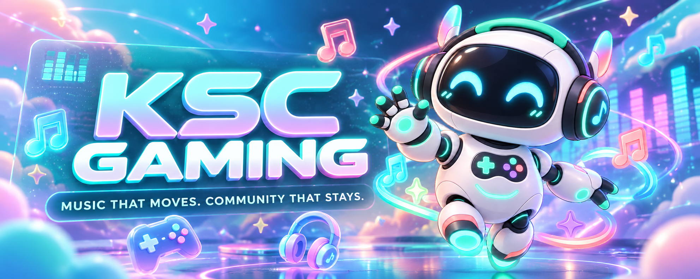
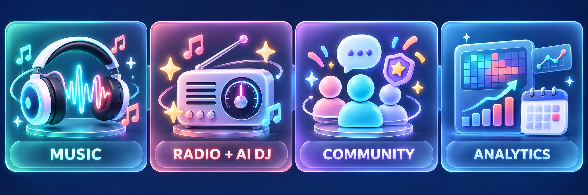

<div align="center">
  

  <p>
    <strong>Discord-native music player · AI DJ · living community system</strong><br />
    Phát nhạc Việt đúng gu, ghi nhận từng khoảnh khắc cộng đồng.
  </p>

  <p>
    <a href="#-trải-nghiệm"><strong>Trải nghiệm</strong></a>
    ·
    <a href="#-music-system"><strong>Music System</strong></a>
    ·
    <a href="#-community-system"><strong>Community System</strong></a>
    ·
    <a href="#-khởi-động"><strong>Khởi động</strong></a>
  </p>

  <p>
    
    
    
    
    
  </p>
</div>

---

## ✨ Tổng quan

<p align="center">
  
  
  
  
</p>

<table>
  <tr>
    <td width="18%" align="center">
      
    </td>
    <td width="82%" valign="middle">
      <strong>KSC Gaming không phải tập hợp những command rời rạc.</strong><br /><br />
      Bot được xây như một sản phẩm Discord hoàn chỉnh: player cố định, UI tương tác,
      dữ liệu bền vững, automation cộng đồng và một hệ thống đồ họa dùng chung mascot KSC.<br /><br />
      <strong>Ít rác trong chat · Ít thao tác thủ công · Nhiều tín hiệu hữu ích</strong>
    </td>
  </tr>
</table>

## 🌈 Trải nghiệm

<table>
  <tr>
    <td width="50%" align="center">
      
      <br />
      <strong>Welcome, có chuyển động</strong>
      <br />
      <sub>Shimmer, avatar pulse và hướng dẫn nhập hội.</sub>
    </td>
    <td width="50%" align="center">
      
      <br />
      <strong>Birthday Celebration</strong>
      <br />
      <sub>Confetti, lời chúc và diện mạo riêng trong ngày sinh nhật.</sub>
    </td>
  </tr>
</table>

<p align="center">
  
</p>

<p align="center">
  <strong>Một visual language xuyên suốt.</strong><br />
  <sub>Dark glass · pastel accents · mascot KSC · card 1200 × 675 · tối đa 5 huy hiệu nổi bật</sub>
</p>

## 🧩 Hệ sinh thái

<p align="center">
  
</p>

<p align="center">
  
  
  
  
</p>

## 🎧 Music System

### 🎛️ Player giữ kênh chat sạch

- Tin nhắn gọi nhạc được xóa sau khi xử lý.
- Chỉ duy trì một Player công khai và cập nhật ngay trên message hiện có.
- Now Playing webhook tự trở lại cuối kênh khi hội thoại tiếp tục.
- Thumbnail, waveform, progress, volume, loop, queue và audio profile nằm trong cùng UI.
- YouTube được pipe thẳng từ `yt-dlp` sang FFmpeg để hạn chế URL CDN hết hạn và HTTP 403.

```text
REQUEST
   │
   ├── YouTube / SoundCloud / Playlist
   │
   ▼
DISCOVERY ──► METADATA ──► FAIR QUEUE ──► AUDIO PIPELINE
   │                                          │
   └── Radio / AI DJ                          ├── Realtime EQ
                                              └── FFmpeg effects
```

### 📻 Radio và AI DJ

| | 📻 **Radio** | ✨ **AI DJ** |
|---|---|---|
| Câu hỏi | “V-Pop hiện có gì hot?” | “Trong nhạc Việt đang hot, đâu là đúng gu tôi?” |
| Điều khiển | Bot tự chọn hoàn toàn | Chọn genre, vibe, độ trend và độ mới |
| Nguồn | Nhạc Việt, Official MV | Cùng kho Official MV đã kiểm duyệt |
| Độ dài | 12 bài và tiếp tục tự động | Mix 18 bài |
| Chống lặp | URL gần đây và nghệ sĩ trong 5 lượt | Loại trùng trong mỗi mix |

**5 Radio**

`V-Pop Trending` · `Nhạc Việt Mới` · `Đang Tăng Nhanh` · `Triệu View` · `V-Pop Hits`

**16 AI DJ presets**

`Trending` · `Nhạc mới` · `Hit lớn` · `Chill` · `Love` · `Tâm trạng` · `Năng lượng` ·
`Rap Việt` · `Drill` · `Hoodtrap` · `Jerk Drill` · `Sexy Drill` · `Trap` · `Rage` ·
`Melodic Rap` · `Hip-Hop / R&B`

<details>
<summary><strong>Official MV policy</strong></summary>

Bot ưu tiên nghệ sĩ và label chính thức, lượt xem cao, bài mới và tín hiệu tăng trưởng thực.
Các định dạng sau bị loại khỏi Radio và AI DJ:

- Lyrics, karaoke và official audio
- Cover, reupload và fanmade
- Sped up, slowed, nightcore và visualizer
- Live performance, bootleg, mashup và remix không chính thức
- Video ngắn dưới 90 giây hoặc dài hơn 8 phút

Tăng trưởng 7 ngày được tính từ snapshot lượt xem đã quan sát, không tạo số liệu giả.

</details>

### 🎚️ Audio và thư viện

| 🎚️ **Audio Lab** | 💿 **Music Library** |
|---|---|
| Equalizer realtime không ngắt bài | Favorites và playlist cá nhân |
| Bass Boost, 8D, Reverb | Lịch sử và thống kê nghe nhạc |
| Nightcore, Vaporwave, Slow + Reverb | Lyrics có phân trang |
| Khôi phục đúng vị trí sau khi đổi effect | Music Profile và yearly Wrapped |

## 🎉 Community System

<table>
  <tr>
    <td width="50%" valign="top">
      <h3>👤 Member Journey</h3>
      Welcome Card → Introduction → Activity Profile → Achievement → Birthday → Weekly Recap
    </td>
    <td width="50%" valign="top">
      <h3>⚙️ Admin Journey</h3>
      Control Center → Channel Mapping → Privacy → Analytics → Member Log → Event Insights
    </td>
  </tr>
</table>

- Theo dõi ngày gắn bó, tin nhắn và thời gian voice bằng batch scan nhẹ.
- Tự mở khóa 30 achievement và tự ghim 5 huy hiệu nổi bật lên Profile Card.
- Công bố achievement tại `#celebrations`, ngoại trừ huy hiệu thành viên mới.
- Birthday có quyền riêng tư, bảng lời chúc phân trang và decoration riêng trên Profile Card.
- Weekly Recap, Birthday và Analytics đều có cơ chế chống đăng trùng.
- Heatmap, peak time, member funnel, growth, retention và Discord Event Analytics.
- Bật/tắt tính năng, chọn kênh và privacy ngay trong `#bot-config`.

## 🎮 Command Deck

Mọi command đều có slash form. Các thao tác gọi nhạc phù hợp vẫn hỗ trợ prefix `!`.

<details open>
<summary><strong>Music essentials</strong></summary>

| Command | Công dụng |
|---|---|
| `/phat [tên hoặc URL]` | Phát YouTube, SoundCloud hoặc playlist. |
| `/soundcloud <tên hoặc URL>` | Tìm trực tiếp trên SoundCloud. |
| `/pause` · `/resume` | Tạm dừng hoặc tiếp tục. |
| `/skip` · `/stop` | Bỏ qua hoặc kết thúc phiên nghe. |
| `/queue` · `/shuffle` · `/clearqueue` | Quản lý hàng đợi. |
| `/volume` · `/loop` | Âm lượng và chế độ lặp. |
| `/radio` · `/aidj` | Radio xu hướng hoặc mix theo gu. |
| `/equalizer` · `/hieuung` | Điều chỉnh chất âm. |

</details>

<details>
<summary><strong>Library & social listening</strong></summary>

| Command | Công dụng |
|---|---|
| `/yeuthich` · `/playlist` | Thư viện cá nhân. |
| `/lichsu` · `/thongke` | Lịch sử và thống kê nghe. |
| `/loibaihat` | Lời bài hát đang phát. |
| `/party` | Listening Party trong voice channel. |
| `/hosonhac` · `/wrapped` | Music Profile và tổng kết năm. |
| `/congbang` · `/tuphat` | Fair Queue và Autoplay. |

</details>

<details>
<summary><strong>Community & administration</strong></summary>

| Command | Công dụng |
|---|---|
| `/hoso [thanhvien]` | Profile Card của bạn hoặc thành viên khác. |
| `/huyhieu` · `/thanhtich` | Bộ sưu tập và tiến độ achievement. |
| `/gioithieu` | Form giới thiệu bản thân. |
| `/sinhnhat` · `/lichsinhnhat` | Sinh nhật và lịch cộng đồng. |
| `/weekly` | Weekly Recap gần nhất. |
| `/analytics` | Dashboard 7, 30 hoặc 90 ngày. |
| `/communitysettings` | Community Control Center. |
| `/communitysetup` · `/communitypreview` | Kiểm tra cấu hình và xem trước card. |
| `/traohuyhieu` | Trao achievement đặc biệt. |
| `/help` | Trợ giúp nhanh. |

</details>

## 🚀 Khởi động

### Yêu cầu

`Python 3.11+` · `FFmpeg` · Discord bot token · `Message Content Intent` · `Server Members Intent`

<details open>
<summary><strong>Windows</strong></summary>

```powershell
git clone https://github.com/peaceful-fptu-k16/KSCSupport.git
cd KSCSupport
./setup.bat

venv\Scripts\activate
python bot.py
```

</details>

<details>
<summary><strong>Linux / VPS</strong></summary>

```bash
git clone https://github.com/peaceful-fptu-k16/KSCSupport.git
cd KSCSupport
chmod +x setup.sh
./setup.sh

source venv/bin/activate
python bot.py
```

</details>

Khi sẵn sàng, log hiển thị `Connected as ...` và số slash command đã đồng bộ.
Đặt `DISCORD_GUILD_ID` để command xuất hiện gần như ngay lập tức tại server chính;
bot sẽ xóa bản global cũ nhằm tránh command trùng.

## 🎨 Configuration

Sao chép `.env.example` thành `.env`. Không commit token, cookie hoặc webhook URL.

| Biến | Mặc định | Vai trò |
|---|---|---|
| `DISCORD_BOT_TOKEN` | Bắt buộc | Token đăng nhập bot. |
| `DISCORD_GUILD_ID` | Trống | Guild-only command sync. |
| `BOT_PREFIX` | `!` | Prefix cho hybrid command. |
| `BOT_BRAND_NAME` | `KSC Gaming` | Tên thương hiệu toàn hệ thống. |
| `BOT_MASCOT_PATH` | `docs/assets/ksc-mascot.png` | Mascot cho bot, webhook và card. |
| `SYNC_BRAND_AVATARS` | `true` | Đồng bộ avatar khi khởi động. |
| `FFMPEG_BINARY` | Tự dò | Đường dẫn FFmpeg tùy chỉnh. |
| `YTDLP_COOKIE_FILE` | Trống | Cookie Netscape cho YouTube giới hạn. |
| `MUSIC_DATABASE_PATH` | `data/music.db` | Music library và history. |
| `COMMUNITY_DATABASE_PATH` | `data/community.db` | Profile và analytics. |

<details>
<summary><strong>Now Playing webhook</strong></summary>

| Biến | Vai trò |
|---|---|
| `DISCORD_NOW_PLAYING_WEBHOOK_URL` | Webhook nhận card bài đang phát. |
| `NOW_PLAYING_WEBHOOK_NAME` | Tên webhook, mặc định `KSC Music`. |
| `NOW_PLAYING_WEBHOOK_GUILD_ID` | Server cung cấp avatar. |
| `NOW_PLAYING_WEBHOOK_REFRESH_SECONDS` | Chu kỳ cập nhật tiến trình. |

Webhook giữ một message duy nhất và tự đưa message xuống cuối khi cần.

</details>

<details>
<summary><strong>Server Guide webhook</strong></summary>

| Biến | Vai trò |
|---|---|
| `DISCORD_SERVER_GUIDE_WEBHOOK_URL` | Giới thiệu server, bản đồ kênh và rules. |
| `SERVER_GUIDE_WEBHOOK_NAME` | Tên webhook, mặc định `KSC Gaming`. |
| `SERVER_GUIDE_WEBHOOK_GUILD_ID` | Server cung cấp avatar. |
| `SERVER_GUIDE_BUMP_DELAY_SECONDS` | Thời gian chờ trước khi bump guide. |

</details>

## 🗂️ Discord Layout

Bot tự nhận diện tên kênh ngay cả khi có emoji đứng trước.

```text
WELCOME                         COMMUNITY
├── welcome                     ├── gossip
├── announcements               ├── music
├── introductions               ├── celebrations
└── rules                       ├── events
                                └── weekly-recap

STAFF
├── community-analytics
├── member-log
└── bot-config
```

| Kênh | Bot đăng gì tại đây? |
|---|---|
| `welcome` | Welcome Card và hướng dẫn thành viên mới. |
| `introductions` | Bài giới thiệu gửi từ modal. |
| `celebrations` | Birthday và achievement tự động. |
| `weekly-recap` | Báo cáo tuần bảy trang. |
| `community-analytics` | Dashboard tăng trưởng và hoạt động. |
| `member-log` | Join, leave và thay đổi thành viên phù hợp privacy. |
| `bot-config` | Control Center dành cho quản trị viên. |

## 🏗️ Architecture

```text
Discord Gateway
      │
      ├── Music Cog ─────► GuildPlayerSession ─────► Voice / FFmpeg
      │      │                    │
      │      ├── Discovery       └── Music SQLite
      │      └── Components V2
      │
      ├── Community Cog ─► Schedulers / Events ───► Community SQLite
      │      │
      │      └── Cards / Views / Analytics
      │
      └── Brand Layer ───► Bot avatar / Webhooks / Mascot
```

<details>
<summary><strong>Source map</strong></summary>

```text
KSCSupport/
├── bot.py                      Entry point, intents và command sync
├── branding.py                 KSC identity và avatar sync
├── cogs/
│   ├── music.py                Music commands và interaction flow
│   └── community.py            Events, schedulers và admin commands
├── music/
│   ├── discovery.py            V-Pop policy, ranking và anti-repeat
│   ├── extractor.py            yt-dlp metadata và stream resolution
│   ├── player.py               Voice lifecycle và race protection
│   ├── repository.py           Music library SQLite
│   └── ui/                     Player, queue, search, library và cards
├── community/
│   ├── achievements.py         Achievement catalog và ranking
│   ├── repository.py           Profile, birthday và analytics SQLite
│   ├── cards.py                PNG / animated GIF renderer
│   ├── guide_webhook.py        Fixed Server Guide webhook
│   └── ui.py                   Views, modals và dashboards
├── docs/assets/                Mascot và product media
├── scripts/                    Asset build tools
└── tests/                      Unit và behavior tests
```

</details>

Mỗi server sở hữu một `GuildPlayerSession`. `generation` token ngăn audio cũ quay lại
sau `stop` hoặc disconnect. Equalizer chạy trực tiếp trên PCM; effect thay đổi tempo hoặc
không gian sẽ nối lại bằng FFmpeg tại đúng vị trí đang nghe.

## 🛡️ Privacy & Quality

| Privacy | Quality gate |
|---|---|
| Dữ liệu nằm cục bộ trong SQLite. | 79 unit và behavior tests. |
| Sinh nhật chỉ lưu ngày và tháng. | Queue concurrency và race-condition coverage. |
| Thành viên tự chọn mức công khai. | Card render được kiểm tra kích thước và định dạng. |
| Không lưu nội dung tin nhắn. | Discovery dùng số liệu quan sát thực. |
| Secret chỉ nằm trong `.env`. | Slash command được chống đăng ký trùng. |

```bash
python -m unittest discover -s tests -v
```

## 🧰 Troubleshooting

<details>
<summary><strong>Slash command chưa xuất hiện</strong></summary>

Kiểm tra `DISCORD_GUILD_ID`, khởi động lại bot và tìm log
`Synced ... guild slash commands`. Bot cần scope `bot` và `applications.commands`.

</details>

<details>
<summary><strong>Bot vào voice nhưng không phát nhạc</strong></summary>

Kiểm tra quyền `Connect` / `Speak`, FFmpeg và dependency voice. Trên Windows có thể đặt
đường dẫn đầy đủ bằng `FFMPEG_BINARY=C:\ffmpeg\bin\ffmpeg.exe`.

</details>

<details>
<summary><strong>YouTube yêu cầu xác minh</strong></summary>

Xuất cookie Netscape vào file cục bộ và khai báo `YTDLP_COOKIE_FILE`.
Không commit cookie vào repository.

</details>

---

<div align="center">
  
  <br />
  <strong>KSC Gaming</strong>
  <br />
  <sub>Music that moves. Community that stays.</sub>
</div>
